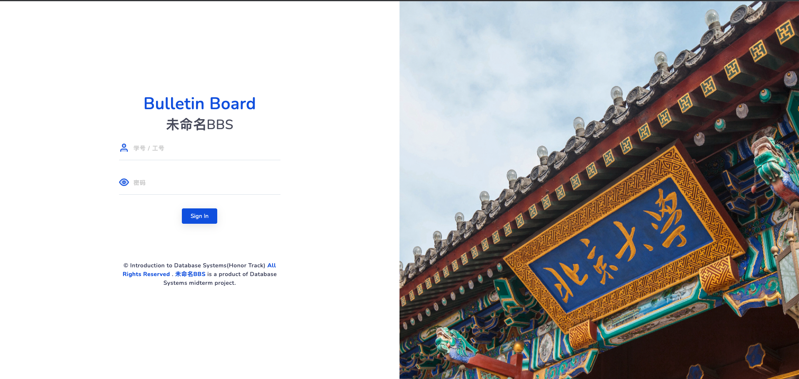

# 未命名BBS

基于`python3.8`和`Django4.0`的BBS系统。   

## 主要功能：

<p align="center">
 
</p>

- 本课程设计完成了Web应用“未命名BBS”的开发。该应用旨在解决学院职能部门与同学之间信息交流不通畅的问题，直击同学们“遇到事情不知道找谁解决”的痛点，为学院内部的师生提供一个透明公开、简单易用、美观大气的数字化反馈中心；
- 开发基于Django框架，利用MySQL数据库、HTML5+Bootstrap4的前端框架实现了美观、实用的用户界面和功能系统。
- 经过本次课程设计，组员们进一步熟悉了MySQL数据库的基本操作和高级特性，掌握了前后端开发的Web技术。

## 安装
- mysql8.0
- django4.0

## 运行

 修改`dbmid/dbmid/setting.py` 修改数据库配置，如下所示：

```python
DATABASES = {
    'default': {
        'ENGINE': 'django.db.backends.mysql',
        'NAME': 'dbmid',
        'USER': '$root',
        'PASSWORD': '$password',
        'HOST': 'host',
        'PORT': 3306,
    }
}
```

### 创建数据库
mysql数据库中执行:
```sql
CREATE DATABASE `dbmid` charset='utf8mb4';
```

然后终端下执行:
```bash
python manage.py makemigrations
python manage.py migrate
```

### 创建超级用户

 终端下执行:
```bash
python manage.py createsuperuser
```

### 创建测试数据
终端下执行:
```bash
python manage.py shell
(shell)> from generate_testcase import generate_all
(shell)> generate_all()
```

### 开始运行：
执行： `python manage.py runserver`

浏览器打开: http://127.0.0.1:8000/  就可以看到效果了。  


## 问题相关

有任何问题欢迎提Issue,或者将问题描述发送至我们的邮箱 <linhaowei@pku.edu.cn>, <hbz19@pku.edu.cn>。我们会尽快解答。
